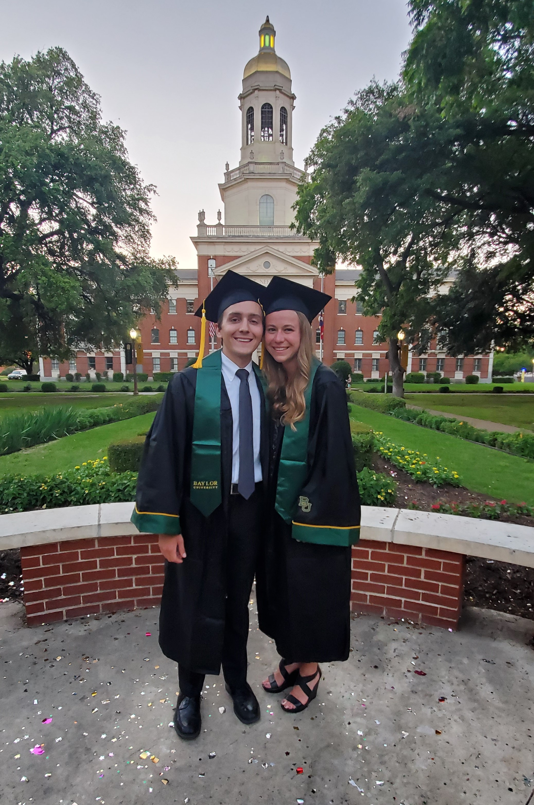

I am currently a PhD student in Cognition and Neuroscience at the University of Texas at Dallas.
My research is on multivariate statistics and their applications to data in cognition, neuroscience, other fields collecting large amounts of data.
I enjoy analyzing data, and my language of choice is R.
More about my experiences and skills can be found on my resume. 

## How I got here

I grew up primarily in McKinney, TX.
I was a theater kid and Eagle Scout, and I excelled at my classes all through K-12[^1].
My favorite classes were science and math, and my senior year of high school I took AP Computer Science loved it.

[^1]: *Narrator*: "Luke was a nerd in high school, but at least he was very happy."

### Baylor

I went to Baylor University where I studied neuroscience, with minors in computer science and mathematics. 
I was a research assistant in the Sekeres Memory Lab, where I worked on data collection and analysis for behavioral experiments with mice.
In my computer science courses, I learned to solve problems using C++. 
Along my way to graduating summa cum laude, I also had a lot of cool experiences:

- I learned Italian and studied abroad for 6 weeks in Florence.
- I mentored incoming first-year and prospective students as a "Student Ambassador" for the Psychology and Neuroscience department.
- I worked at the Baylor Marina, where I got *paid* to kayak, paddleboard, and teach sailboat classes on a sandy beach.
- I ran the Bearathon --- "the Toughest Half-Marathon in Texas".

But alas, at some point it was time to go.

<figure>
  
  <figcaption>Found an amazing girl along the way too!</figcaption>
</figure>

### UT Dallas

In 2019, arrived in Richardson, Texas to start my PhD in Cognition and Neuroscience with Dr. Herv&eacute; Abdi. 
I knew from my college experience that I wanted to apply my math and computer science knowledge to data in the biosciences. 
Dr. Abdi's lab was the perfect fit, and in my first two years in the program I learned my love for R and statistics.
For my first year project, I created a new multivariate method called PLSMFA and wrote an [R package](https://github.com/LukeMoraglia/PLSMFA){:target="_blank"} to implement it.
Right now, I am finishing up my second year project, a literature review about permutation tests for multivariate methods.
I've also been working on collaborative projects where I analyze and visualize data with R to answer questions about autism spectrum disorder, occupational skills, and decision making.
Entering the start of my third year (Fall 2021), I am a teaching assistant for Dr. Abdi's advanced multivariate statistics and programming in R classes.
I'm very excited to keep learning more about statistics and R, and how we can apply both to data analysis for research in cognition, neuroscience, and a wide array of other fields.

## Personal interests

I love to learn, so I have a habit of becoming obsessed with a new topic and diving deep into it to learn everything I can. 
They don't all become passions or hobbies, but some stick around long-term.
Here is a quick list of some of the things I am most interested in right now.

- Sustainability
   - Climate change
   - Clean energy
   - Plant-based diet
- Health and Nutrition
   - Running
   - Weight training
   - Plant-based diet (*again*)
   - Supplements and vitamins
- Outdoors
   - Camping
   - Hiking
   - Astronomy and stargazing
- Cooking and Food
   - Fermentation
   - Homebrewing beer
   - Kombucha